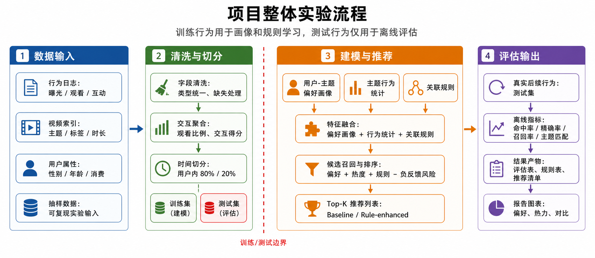
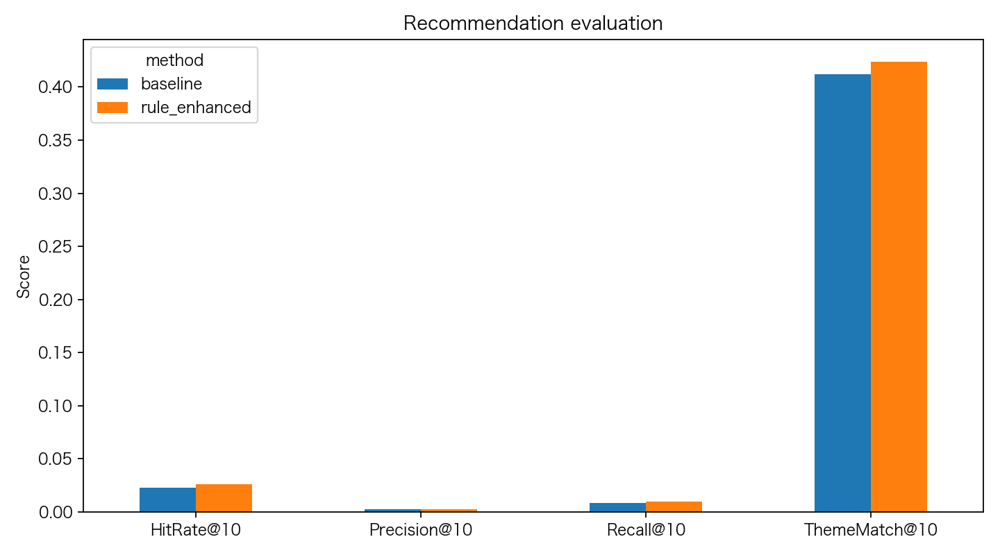
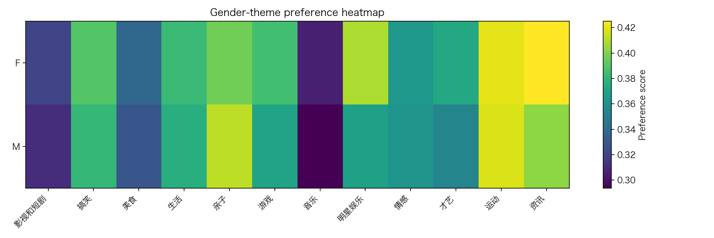
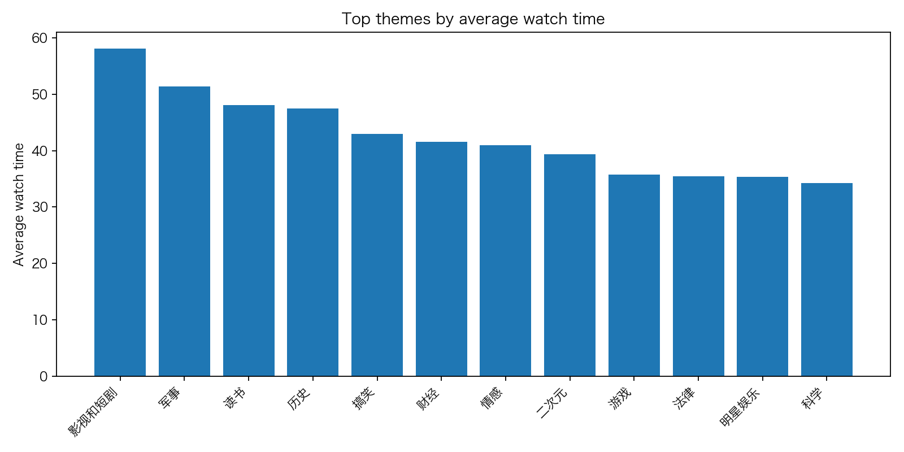
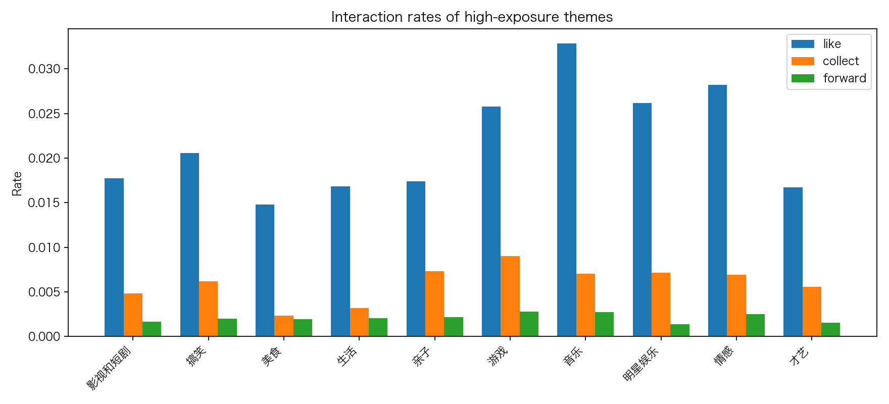

# 短视频主题偏好分析与推荐策略优化

> 基于 Tsinghua ShortVideo Dataset 抽样数据的主题偏好分析、关联规则挖掘与推荐策略优化

## 项目概览

本项目围绕短视频推荐中的一个核心问题展开：如何从观看、点赞、收藏、评论、转发和负反馈等弱监督行为中识别用户的主题偏好，并将群体规律转化为可解释的推荐增益。

项目以 `Tsinghua ShortVideo Dataset` 的小规模抽样数据为基础，完成了从原始交互清洗、用户-视频聚合、训练测试切分、主题行为统计、用户-主题偏好画像、关联规则挖掘，到 `baseline` 与 `rule-enhanced` 推荐方案离线对比评估的完整流程。

## 项目亮点

- 构建了用户-视频级交互表，解决一次曝光对应多标签导致的重复统计问题。
- 将观看比例、有效观看、互动反馈与负反馈统一映射为可解释的主题偏好得分。
- 在训练集上同时学习个体偏好与群体规则，测试集只用于离线评估，避免信息泄漏。
- 保留了本地 Python、Spark 与 Hive 三套实现路径，兼顾课程展示与大数据处理工具链要求。
- 输出完整实验产物，包括统计表、规则表、推荐清单与图表。

## 实验流程

下图展示了项目的整体实验流程。训练集用于画像与规则学习，测试集只用于离线评估。



## 仓库结构

```text
.
├── README.md
├── .gitignore
├── scripts/
│   ├── run_local_pipeline.py       # 本地一键实验流程
│   ├── check_outputs.py            # 输出文件校验与摘要打印
│   └── draw_method_pipeline_cvpr.py
├── spark/
│   └── theme_preference_spark.py   # Spark 版本主题统计与 FP-Growth
├── hive/
│   └── shortvideo_analysis.sql     # Hive 建表、清洗与聚合 SQL
├── data_clean/
│   ├── interactions_clean.csv      # 清洗后的用户-视频交互数据
│   ├── user_profile.csv            # 用户画像基础表
│   └── video_catalog.csv           # 视频目录基础表
├── output/
│   ├── tables/                     # 主题统计、用户偏好、评估结果
│   ├── rules/                      # 关联规则结果
│   ├── recommendations/            # 推荐结果
│   └── figures/                    # 可视化图表
```

## 数据说明

原始数据来自 `Tsinghua ShortVideo Dataset`。由于完整视频与行为数据体量较大，本仓库只保留复现实验所需的轻量输入与输出，不上传原始视频文件和原始大表。

仓库中保留：

- 清洗后的轻量数据表
- 主题行为统计结果
- 用户-主题偏好画像
- 关联规则结果
- 推荐结果与评估结果
- 可视化图表

如需重新运行本地流水线，请自行准备原始抽样数据，并放到：

```text
data_raw/shortvideo_tiny/
  interaction_sampled.csv
  categories_cn_en.csv
```

## 环境依赖

本地流程依赖：

- Python 3.9+
- pandas
- numpy
- matplotlib

Spark 版本依赖：

- PySpark 或可用的 `spark-submit`

Hive 版本依赖：

- Hive 或兼容 Hive SQL 的离线数仓环境

## 快速开始

在仓库根目录执行：

```bash
python3 scripts/run_local_pipeline.py
python3 scripts/check_outputs.py
```

`run_local_pipeline.py` 会完成：

1. 读取原始抽样 CSV。
2. 清洗布尔字段、派生 `watch_ratio` 和 `effective_view`。
3. 聚合同一用户-视频曝光的多标签重复行。
4. 输出清洗后的交互表和基础画像表。
5. 按用户内时间顺序切分训练集和测试集。
6. 在训练集上生成主题行为统计、用户-主题偏好和关联规则。
7. 构建 `baseline` 与 `rule-enhanced` 两套推荐结果。
8. 使用测试集进行离线评估并输出图表。

## Spark 与 Hive

Spark 版本运行：

```bash
spark-submit spark/theme_preference_spark.py
```

Hive SQL 位于：

```text
hive/shortvideo_analysis.sql
```

脚本中包含原始表 DDL、类别映射表、清洗视图、主题行为聚合表、用户-主题偏好表和用户分组主题统计表。实际运行时需根据集群环境调整 `LOCATION`。

## 推荐策略设计

- `Baseline`：仅使用训练集中的用户历史主题偏好和视频热门度排序。
- `Rule-enhanced`：在 `baseline` 基础上加入分群主题成功率、强关联规则质量、相似主题迁移、标签级规则匹配与负反馈风险惩罚。

为避免信息泄漏，用户偏好、规则、热门度和候选集合全部只由训练集构建，测试集只参与评估。

## 核心结果

### 数据规模

| 口径 | 清洗交互 | 训练交互 | 测试交互 | 用户 | 视频 | 主题 | 规则 |
| --- | ---: | ---: | ---: | ---: | ---: | ---: | ---: |
| 数量 | 129,483 | 101,690 | 27,793 | 6,654 | 31,496 | 36 | 7,658 |

### 推荐评估

| 方法 | HitRate@10 | Precision@10 | Recall@10 | ThemeMatch@10 |
| --- | ---: | ---: | ---: | ---: |
| baseline | 0.023013 | 0.002398 | 0.008712 | 0.412038 |
| rule_enhanced | 0.026107 | 0.002649 | 0.009914 | 0.423806 |

`rule-enhanced` 在四项指标上都优于 `baseline`，说明训练集中的群体主题规律和关联规则可以为个体主题偏好推荐提供稳定补充。

### 高曝光主题示例

| 主题 | 曝光数 | 平均观看比例 | 有效观看率 |
| --- | ---: | ---: | ---: |
| 影视和短剧 | 18,469 | 0.3704 | 0.7283 |
| 搞笑 | 11,623 | 0.5114 | 0.7607 |
| 美食 | 7,298 | 0.4290 | 0.6905 |
| 生活 | 6,298 | 0.5239 | 0.7191 |
| 亲子 | 4,656 | 0.5629 | 0.7448 |

## 图表展示

### 推荐效果对比



### 性别-主题偏好热力图



### 主题行为统计图

<p align="center">
  
  
</p>

## 主要输出文件

- `output/tables/theme_behavior_summary.csv`：不同主题下的观看、点赞、收藏、转发等行为统计
- `output/tables/user_group_theme_summary.csv`：不同用户群体下的主题偏好统计
- `output/tables/user_theme_preference.csv`：用户-主题偏好画像
- `output/rules/theme_behavior_rules.csv`：主题、标签与行为之间的关联规则
- `output/recommendations/baseline_recommendations.csv`：基础推荐结果
- `output/recommendations/rule_enhanced_recommendations.csv`：规则增强推荐结果
- `output/tables/evaluation_summary.csv`：离线评估结果

## 说明

本仓库用于课程学习与实验展示，不包含原始大体量视频数据。若需完整复现实验，请先根据数据集说明自行准备原始抽样数据，再执行本地、Spark 或 Hive 流程。
